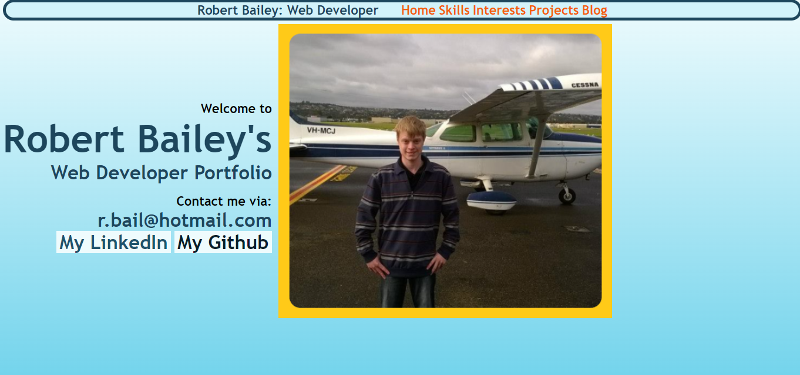
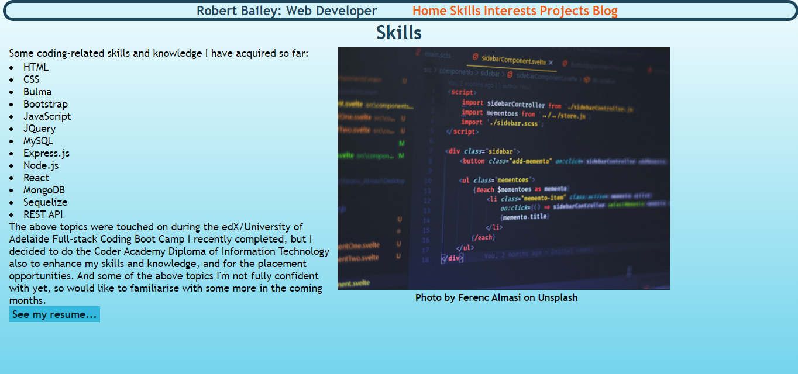
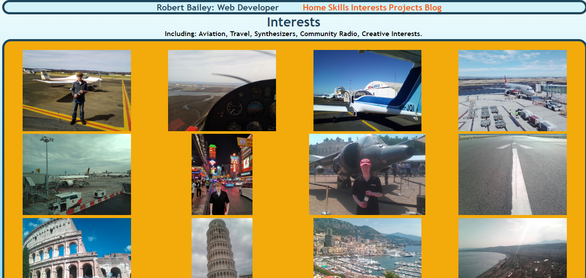
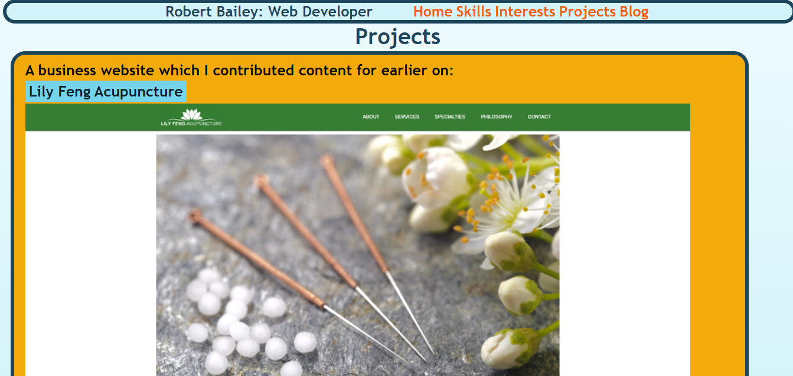
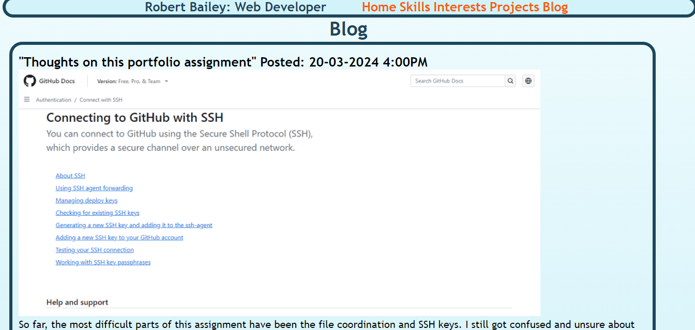
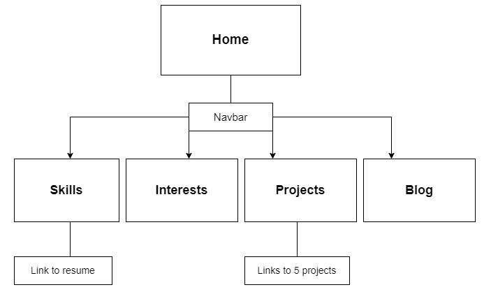

# RobertBailey_T1A2
## Link to Application
https://robertbail.github.io/RobertBailey_T1A2/

## Link to GitHub Repo
https://github.com/RobertBail/RobertBailey_T1A2

## Link to Wireframe
https://www.figma.com/file/dTQsJhCh9j0KAPUKiQ4A37/RBportfolioWireframe?type=design&node-id=1%3A21&mode=design&t=O8AKt8a8DnprSBK5-1

## Link to Presentation
(presentation video link)

## Description
### Purpose:
A portfolio website which provides an overview of my skills, interests, web/coding projects and contact information.

### Functionality / features:
- A Home page, which includes my contact information
- A Skills page, which details some of my coding skills so far, with a link to my resume
- An Interests page, featuring an image grid/gallery, to display some of my hobbies and interests
- A Projects page, which features some of my web/coding projects so far, including links and screenshots for these
- A Blog page, which I decided to write a few coding/IT related things on
- A navbar which links these pages

### Screenshots:

### Sitemap:

 
### Target audience:
I have intended this portfolio website mainly for prospective employers or other people to network with in IT or coding, but I treated the Interests and Blog sections a bit like a social media profile, since I don't really use Facebook and Instagram etc. anymore, so maybe others outside of IT and coding.

### Tech stack:
html, css, uicolors, GitHub Pages